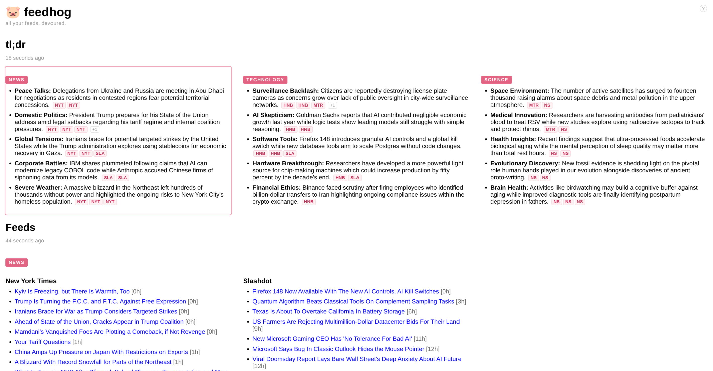
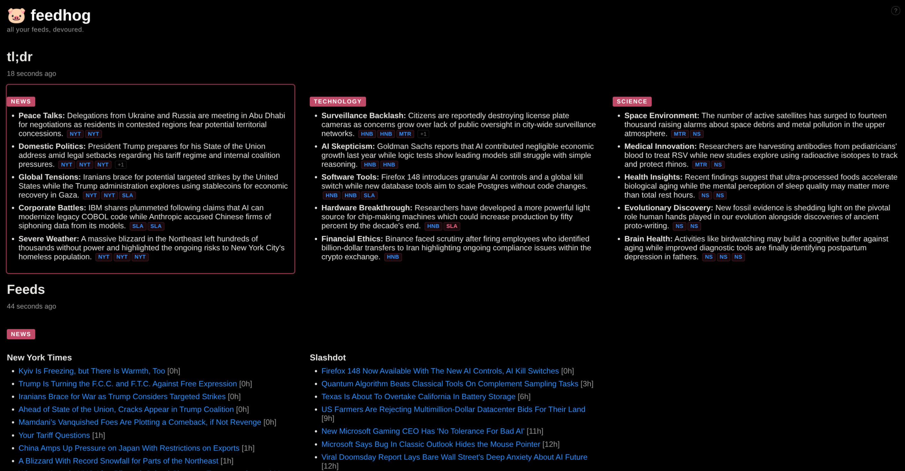

# 🐷 feedhog

`all your feeds, devoured.`

A self-hosted RSS feed aggregator that uses AI to generate summaries of your news feeds.

<p align="left">
  <a href="screenshots/screenshot-light.png"></a>
  &nbsp;
  <a href="screenshots/screenshot-dark.png"></a>
</p>

Feedhog fetches articles from your configured RSS/Atom feeds, groups them by category, and produces concise bullet-point summaries. It runs as a small web app that refreshes on a schedule and serves a single-page dashboard.

## Features

- Aggregates any number of RSS/Atom feeds, organized by category
- Per-feed control over lookback window (`days`), whether to include the feed in AI summaries, and optional extras (`author`, `comments`)
- AI summaries with structured JSON output and source references — powered by any LLM provider via [LiteLLM](https://github.com/BerriAI/litellm) (Gemini, Claude, OpenAI, and more)
- Configurable refresh interval, number of summary items per category, and model
- Single-page web UI served by FastAPI
- Docker / Docker Compose setup for easy self-hosting
- Fully customizable summarization prompt

## Requirements

- Python 3.12+
- An API key for your chosen LLM provider

## Quickstart

### With Docker Compose (recommended)

1. Clone the repository:
   ```sh
   git clone https://github.com/mlux86/feedhog.git
   cd feedhog
   ```

2. Create a `.env` file with your API key (see [LLM provider](#llm-provider)):
   ```sh
   echo "GEMINI_API_KEY=your_key_here" > .env
   ```

3. Copy the default config and edit it to add your feeds and settings:
   ```sh
   cp config.default.yaml config.yaml
   ```

4. Start the service:
   ```sh
   docker compose up -d
   ```

5. Open `http://localhost:52987` in your browser.

### Without Docker

1. Install dependencies:
   ```sh
   pip install .
   ```

2. Create a `.env` file:
   ```sh
   echo "GEMINI_API_KEY=your_key_here" > .env
   ```

3. Copy the default config:
   ```sh
   cp config.default.yaml config.yaml
   ```

4. Run the app:
   ```sh
   uvicorn main:app --host 0.0.0.0 --port 8000
   ```

## Configuration

All configuration lives in a single `config.yaml` file. Copy the provided default to get started:

```sh
cp config.default.yaml config.yaml
```

### `config.yaml`

```yaml
refresh_interval_hours: 3          # How often to fetch feeds and regenerate summaries
summary_items_per_category: 7      # Maximum bullet points per category in the summary
language: English                  # Language for the generated summaries
model: gemini/gemini-flash-latest  # LiteLLM model string (provider/model)

categories:
  - name: Technology
    feeds:
      - url: https://hnrss.org/best
        source: Hacker News Best
        extras:
          - comments     # Show link to HN discussion thread per article

      - url: https://xkcd.com/atom.xml
        source: xkcd
        summarize: false # Include in feed view but skip AI summary
        days: 14         # Look back up to 14 days (default: 1)
```

#### Feed fields

| Field | Required | Default | Description |
|---|---|---|---|
| `url` | yes | — | URL of the RSS or Atom feed |
| `source` | yes | — | Display name for the feed |
| `summarize` | no | `true` | Whether to include this feed in the AI summary |
| `days` | no | `1` | How many days back to include articles from |
| `extras` | no | `[]` | Optional extra fields to extract per article (see below) |

#### Extras

By default no extra metadata is extracted. Add any of the following to a feed's `extras` list to opt in:

| Value | Description |
|---|---|
| `author` | Show the article author next to the title |
| `comments` | Show a `[c]` link to the comments URL (e.g. the HN discussion thread) |

### LLM provider

The provider is determined by the `model` value in `config.yaml` and the corresponding API key in `.env`. Set whichever key matches your chosen provider:

| Provider | `.env` key | Example model |
|---|---|---|
| Google Gemini | `GEMINI_API_KEY` | `gemini/gemini-flash-latest` |
| Anthropic Claude | `ANTHROPIC_API_KEY` | `claude-sonnet-4-6` |
| OpenAI | `OPENAI_API_KEY` | `gpt-4o` |

See the [LiteLLM docs](https://docs.litellm.ai/docs/providers) for the full list of supported providers and model strings.

### Summarization prompt (`prompt.txt`)

The file `prompt.txt` is passed directly to the LLM as the system prompt. You can edit it freely to change the language, style, or structure of the summaries. The placeholders `{max_items}` and `{language}` are replaced at runtime with values from `config.yaml`.

## License

MIT
